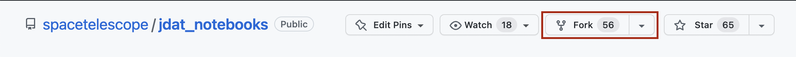

############
GitHub 设置
############

.. _jdat_notebooks: https://github.com/spacetelescope/jdat_notebooks

GitHub 账户
***************

GitHub 是一个提供软件开发和版本控制的互联网托管服务，使用 Git 进行版本控制。
它提供了 Git 的分布式版本控制和源代码管理功能，以及其自身的特性。
如果您还没有 GitHub 账户，请访问 GitHub 的 `注册页面 <https://github.com/join>`_。

仓库设置
****************

**步骤 1：分叉 STScI 仓库**

第一步是创建 STScI `jdat_notebooks`_ 仓库的 GitHub 副本。
您在 GitHub 账户上的复制仓库称为“分叉”。要创建分叉，请点击 STScI 的 `jdat_notebooks`_ 仓库右上角的 **``fork``** 按钮。会弹出一个对话框，您可以选择您的 GitHub 账户来创建分叉。

**步骤 2：克隆仓库**

在您创建了 STScI 仓库的分叉后，您现在应该在您的 GitHub 账户下有一个 STScI 仓库的副本。
下一步是将您和 STScI 的 GitHub 仓库的副本复制到您的本地计算机上。这样，您可以在计算机上进行编辑，并将更改发送到您的在线仓库（分叉）。创建本地副本的过程称为 **克隆**。要克隆 `jdat_notebooks` 仓库，请打开终端窗口并 ``cd`` 进入您希望保存本地副本的目录。然后运行以下 bash 命令：

.. code:: bash

    # 克隆仓库
    git clone https://github.com/<your_github_username>/jdat_notebooks

    # cd 进入本地仓库（克隆）
    cd jdat_notebooks

    # #这将设置 origin 指向您的分叉，目前与主 spacetelescope “上游” 仓库没有连接。因此，您可以通过以下方式将本地克隆指向正确的仓库：
    git remote add upstream https://github.com/spacetelescope/jdat_notebooks.git

**步骤 3：检查远程 URL**

此时，您已完成本地克隆仓库的设置。要检查设置是否成功，请运行以下命令以列出 URL：

.. code:: bash

    # 列出远程 URL
    git remote -v

这应该返回：

.. code:: bash

    <your_github_username>  https://github.com/<your_github_username>/jdat_notebooks.git (fetch)
    <your_github_username>  https://github.com/<your_github_username>/jdat_notebooks.git (push)
    upstream   https://github.com/spacetelescope/jdat_notebooks.git (fetch)
    upstream   https://github.com/spacetelescope/jdat_notebooks.git (fetch)

**步骤 4：创建新分支**

接下来，创建一个新分支并为其命名。您可以将新分支命名为与您的笔记本相关的任何名称。
最好使用一个简短的名称，因为您需要在终端中频繁输入它。通过运行以下命令来完成：

.. code:: bash

    git checkout -b <branch_name>

这将自动将当前分支更改为新分支；
它将保持在此分支上，直到您手动更改或创建一个新分支。

.. tip::

    要切换到已存在的分支，请运行 ``git checkout <branch_name>``

**步骤 5：将新分支与 STScI 同步**

您应该更新分支，以确保它与 STScI 的 `main` 分支同步。为此，请运行：

.. code:: bash

    # 获取更改
    git fetch upstream main

    # 拉取（下载）更改
    git pull upstream main